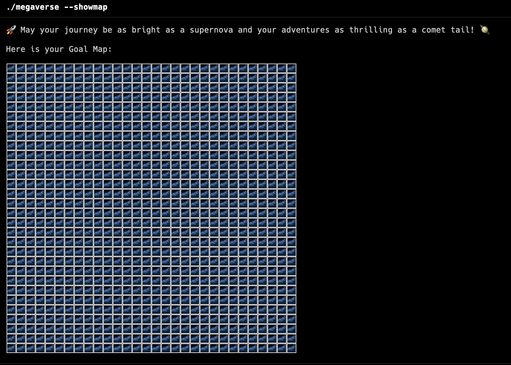
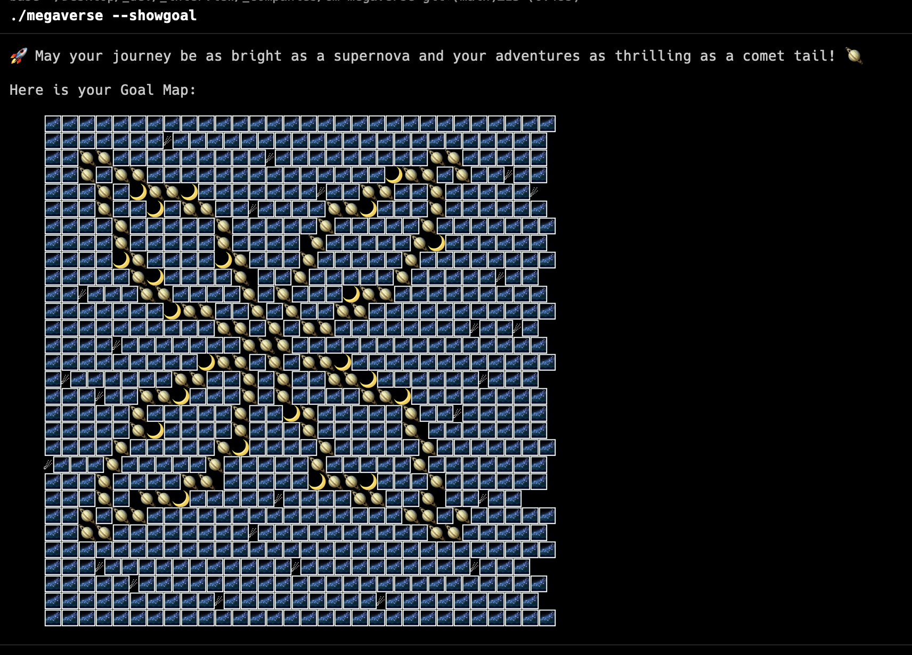
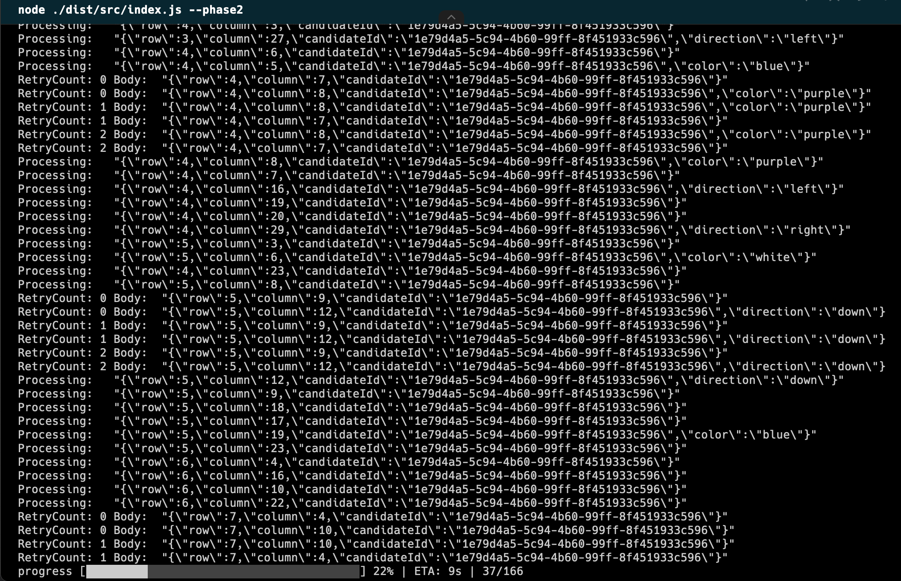
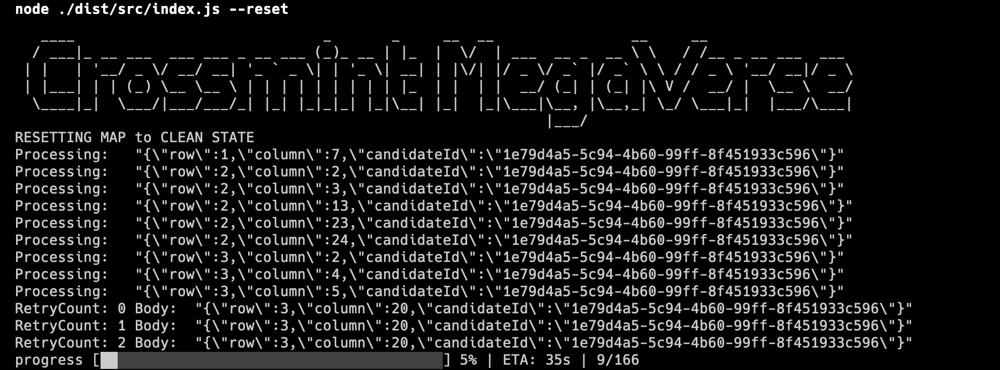

# Megaverse

to install

<code>yarn</code> or <code>bun</code>

Either build executable or use

```
yarn build
node ./dist/index.js
```

See [available Commands.](#commandline)

## Run Tests

<code>yarn test</code>

## Build executable

Easiest way to build executable is using bun.

<code>npm install -g bun</code>

<code>bun create-executable-mac</code>

<code>bun create-executable-windows</code>

<code>bun create-executable-linux</code>

<a name="commandline"></a>

# Command Line Functions

use <code>./megaverse --help</code> to see available commands.

<pre>
   ____                             _       _     __  __                __     __
  / ___|_ __ ___  ___ ___ _ __ ___ (_)_ __ | |_  |  \/  | ___  __ _  __ \ \   / /__ _ __ ___  ___
 | |   | '__/ _ \/ __/ __| '_ ` _ \| | '_ \| __| | |\/| |/ _ \/ _` |/ _` \ \ / / _ \ '__/ __|/ _ \
 | |___| | | (_) \__ \__ \ | | | | | | | | | |_  | |  | |  __/ (_| | (_| |\ V /  __/ |  \__ \  __/
  \____|_|  \___/|___/___/_| |_| |_|_|_| |_|\__| |_|  |_|\___|\__, |\__,_| \_/ \___|_|  |___/\___|
                                                              |___/
Usage: megaverse [options]

Astral Map Explorer: Navigate and Achieve Celestial Goals.

Options:
  -V, --version   output the version number
  -m, --showmap   Show my Map
  -g, --showgoal  Show my Goal Map
  -p1, --phase1   Phase 1 Solution
  -p2, --phase2   Phase 2 Solution
  -r, --reset     Reset
  -h, --help      display help for command

</pre>
<p>
You can use use <code>./megaverse --showmap</code> to see your current map in terminal.

<a href="#"></a>

</p>

<p>
And you can use use <code>./megaverse --showgoal</code> to see your current goal.

<a href="#"></a>
</p>


<p>
And you can use use <code>./megaverse --phase1</code> or <code>./megaverse --phase2</code> to see solve the challenges.

<a href="#"></a>
</p>

<p>
And you can use use <code>./megaverse --reset</code> to see your current goal.

<a href="#"></a>
</p>

